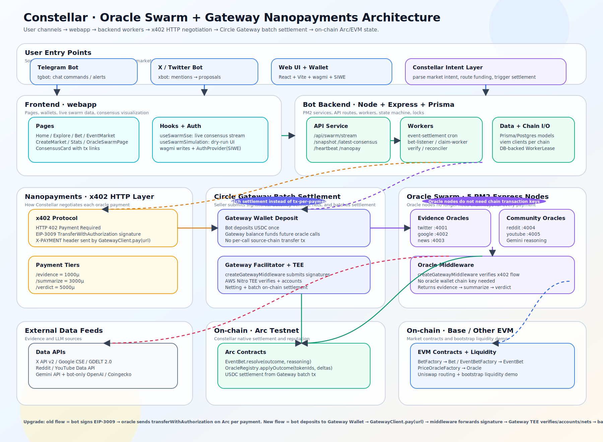
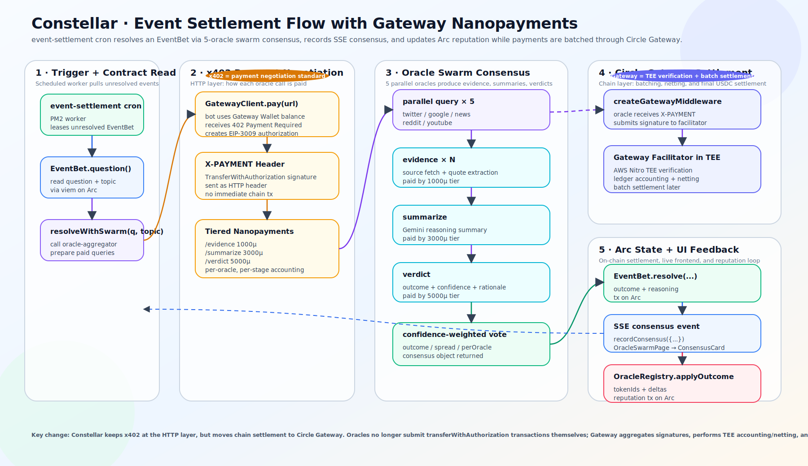

# Constellar

**Coordinated intelligence for programmable judgment.**

Constellar is a multi-agent oracle network built for verifiable judgment in the agentic economy. As AI agents begin to participate in economic workflows, judgment itself needs infrastructure: something accurate, payable, and onchain.

Constellar coordinates specialized AI agents as oracle nodes. Different agents retrieve evidence, interpret resolution criteria, challenge ambiguity, and produce a final structured outcome. Instead of relying on one opaque oracle answer, Constellar creates a judgment pipeline that is modular, auditable, and easier to verify. The system can be used across many scenarios, including e-commerce disputes, governance execution, service or delivery arbitration, and prediction market settlement.

For this demo, we focus on the prediction market use case through an integration with PolyPop (X@_PolyPOP), an Arc-native prediction market that turns X claims into live bets, while Constellar produces the settlement outcome.

Gemini is the intelligence layer behind Constellar. It helps improve factual accuracy, reduce hallucinations through grounded search, access real-time web evidence, and return citations for verification. Arc and Circle Nanopayments make this model economically viable: AI agents can operate as oracle nodes through small paid tasks such as evidence retrieval, verification, API calls, and decision steps, while final outcomes settle in USDC on Arc and remain fully onchain, traceable, and verifiable.

Powered by Circle Nanopayments, Gemini, and Arc Chain.

Live demo: https://x.com/_1_jade_/status/2048165859152269597?s=20

---

## Architecture

### Oracle Swarm + Gateway Nanopayments



The system has seven layers that mirror the diagram above:

| Layer | Components | Role |
| --- | --- | --- |
| **User Entry Points** | Telegram bot, X/Twitter bot, Web UI + wallet, Constellar Intent Layer | Social and wallet-based ways to create or monitor markets; the intent layer parses market intent, routes funding, and triggers settlement |
| **Frontend · webapp** | Pages (Home / Explore / Bet / EventMarket / CreateMarket / Stats / OracleSwarmPage), hooks (`useSwarmSse`, `useSwarmSimulation`), wagmi + SIWE auth | React + Vite app; streams live consensus and renders `ConsensusCard` with tx links |
| **Bot Backend** | API service (`/api/swarm/stream`, `/snapshot`, `/latest-consensus`, `/heartbeat`, `/nanopay`), workers (event-settlement cron, bet-listener, claim-worker, verify / reconciler), Prisma/Postgres, viem clients, DB-backed `WorkerLease` | Node + Express + Prisma on PM2; state machine and locks |
| **Nanopayments · x402** | HTTP 402 Payment Required, EIP-3009 `TransferWithAuthorization`, `X-PAYMENT` header via `GatewayClient.pay(url)` | Payment negotiation standard; tiers: `/evidence` 1000µ, `/summarize` 3000µ, `/verdict` 5000µ |
| **Circle Gateway** | Gateway Wallet deposit, `createGatewayMiddleware`, AWS Nitro TEE facilitator | Bot deposits USDC once; facilitator verifies signatures, nets, and batch-settles — no per-call source-chain transfer tx |
| **Oracle Swarm** | 5 PM2 Express nodes: twitter `:4001`, google `:4002`, news `:4003`, reddit `:4004`, youtube `:4005` with Gemini reasoning | Evidence and community oracles behind Oracle Middleware; returns evidence → summarize → verdict. **No oracle wallet chain key needed.** |
| **External + On-chain** | Data APIs (X API v2, Google CSE, GDELT 2.0, Reddit, YouTube, Gemini, OpenAI, Coingecko); Arc Testnet (`EventBet.resolve`, `OracleRegistry.applyOutcome`, USDC settlement); Base / other EVM (`BetFactory` → `Bet`, `EventBetFactory` → `EventBet`, `PriceOracleFactory`, Uniswap liquidity demo) | Evidence + LLM sources, Constellar-native Arc settlement and reputation, EVM market contracts |

**Why this matters**
- **Batch settlement instead of tx-per-payment.** Chain work is amortized across many oracle calls.
- **Oracle nodes do not need chain transaction keys.** Signature verification and settlement happen inside the Gateway TEE.
- **Upgrade path.** Old flow: bot signs EIP-3009 → oracle sends `transferWithAuthorization` on Arc per payment. New flow: bot deposits to Gateway Wallet → `GatewayClient.pay(url)` → middleware forwards signature → Gateway TEE verifies/accounts/nets → batched chain settlement.

### Event Settlement Flow



The `event-settlement` cron resolves an `EventBet` in five stages:

1. **Trigger + contract read.** PM2 worker leases an unresolved `EventBet`, reads `question()` + topic via viem on Arc, then calls `resolveWithSwarm(q, topic)` on the oracle-aggregator to prepare paid queries.
2. **x402 payment negotiation.** `GatewayClient.pay(url)` spends from the Gateway Wallet balance, receives `402 Payment Required`, creates an EIP-3009 authorization, and sends it as an `X-PAYMENT` header — **no immediate chain tx**. Per-oracle, per-stage accounting is tiered: `/evidence` 1000µ, `/summarize` 3000µ, `/verdict` 5000µ.
3. **Oracle swarm consensus.** Queries fan out in parallel to the 5 oracles (twitter, google, news, reddit, youtube). Each oracle returns **evidence** (source fetch + quote extraction, 1000µ), a **summary** (Gemini reasoning, 3000µ), and a **verdict** (outcome + confidence + rationale, 5000µ). A confidence-weighted vote produces `{outcome, spread, perOracle}`.
4. **Circle Gateway settlement.** Oracles pass `X-PAYMENT` through `createGatewayMiddleware`, which submits signatures to the facilitator. The facilitator runs in an AWS Nitro TEE, performs ledger accounting + netting, and settles in batches later.
5. **Arc state + UI feedback.** The worker calls `EventBet.resolve(outcome, reasoning)` on Arc, emits an SSE consensus event (`recordConsensus(...)` feeding `OracleSwarmPage → ConsensusCard`), and calls `OracleRegistry.applyOutcome(tokenIds, deltas)` to update oracle reputation on Arc.

> **Key change.** Constellar keeps x402 at the HTTP layer, but moves chain settlement to Circle Gateway. Oracles no longer submit `transferWithAuthorization` transactions themselves; Gateway aggregates signatures, performs TEE accounting/netting, and settles in batches.

---

## Repository Layout

```
constellar/
├── contracts/   # Foundry project — EventBet, OracleRegistry, BetFactory, PriceOracleFactory
├── oracles/     # 5-node PM2 Express swarm (twitter/google/news/reddit/youtube) + oracle middleware
├── webapp/      # React + Vite frontend with wagmi + SIWE and live SSE consensus stream
└── images/      # Architecture diagrams (source of truth for this README)
```

## Key Technologies

- **Payments:** x402 (HTTP 402 + EIP-3009), Circle Gateway (TEE-based batch settlement), USDC
- **Chains:** Arc Testnet (native settlement + reputation), Base / other EVM (markets + bootstrap liquidity)
- **Backend:** Node.js, Express, Prisma/Postgres, PM2, viem
- **Frontend:** React, Vite, wagmi, SIWE
- **Oracles:** Gemini reasoning over X API v2, Google CSE, GDELT 2.0, Reddit, YouTube
- **Contracts:** Foundry — `EventBet`, `EventBetFactory`, `Bet`, `BetFactory`, `PriceOracleFactory`, `OracleRegistry`
